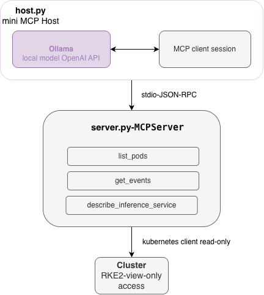
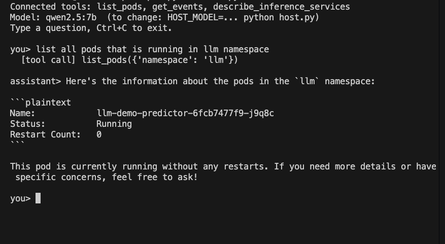

# k8s-ops-mcp

A **read-only Kubernetes diagnostics MCP server**  plus a minimal host that wires a fully local LLM (Ollama) to it. Ask *"is anything wrong in the llm namespace?"* and watch the model call your tools, read your cluster, and explain what it found. No cloud, no API keys, nothing leaves the machine.

> Part of a trilogy: **[Lodestar](https://github.com/YOUR-USERNAME/lodestar)** (a RAG assistant with tracing + evals) and **[llm-serving-platform](https://github.com/YOUR-USERNAME/llm-serving-platform)** (KServe + GitOps serving). Lodestar is the app, the platform serves the models, this project gives the AI *hands*: standardized tools to look at the infrastructure both of them run on.

## Why

While building the serving platform, my debug loop was manual: run `kubectl get events`, copy the output, paste it into an AI, read the diagnosis. Useful but the human was the transport layer.

This project inverts that loop. **MCP (Model Context Protocol)** standardizes how AI clients discover and call tools the CSI/CNI of the AI world: define the contract once, and any client (Claude, an IDE, your own agent) can plug in. So I wrote the driver for my own daily workflow: the diagnostic commands I kept running by hand, exposed as tools an LLM can call itself.

## Architecture



The server is client-agnostic: the same `server.py` works under MCP Inspector, Claude Desktop, or the bundled `host.py`. The host exists because Ollama serves models but doesn't speak MCP  so the ~100-line host does the client's job: list tools, translate them to the OpenAI tool schema, run the call-execute-continue loop.


## Security model

The agent cannot write to the cluster  **not because it's told not to, but because it can't**. The boundary is enforced below the LLM: the server only implements read operations, and it should run with a view-only ServiceAccount token rather than an admin kubeconfig. An LLM's judgement is a preference; RBAC is a guarantee. Design rule: never give a probabilistic component a capability you wouldn't give an intern on day one.

## Run it yourself

Prereqs: Python 3.11+, a kubeconfig with (ideally read-only) cluster access, [Ollama](https://ollama.com) with a tool-capable model.

```bash
pip install "mcp[cli]" kubernetes openai
export KUBECONFIG_PATH=~/.kube/config        # or point server.py at your file

# 1. Test the server without any model — MCP Inspector:
mcp dev server.py --with kubernetes
#    → open the printed URL, call list_pods / get_events by hand

# 2. The full local agent loop:
ollama pull qwen2.5:7b
python host.py
```

Then:

```
you> is anything wrong in the llm namespace?
  [tool call] list_pods({'namespace': 'llm'})
  [tool call] get_events({'namespace': 'llm', 'warnings_only': True})

assistant> ...model's diagnosis of your actual cluster...
```

## Repository layout

```
server.py    # FastMCP server: 3 read-only diagnostic tools
host.py      # minimal MCP host: Ollama ↔ MCP client loop
```

## Output


## Limitations & next steps

Deliberate debts  tracked, not hidden:

- **Small-model tool calling is imperfect.** A 7B model occasionally answers from imagination instead of calling a tool; a nudge fixes it. Documenting the size/reliability trade-off is on the list.
- **Three tools, one cluster's worth of scope.** Next candidates: pod logs (tail-limited), node pressure, isvc-aware "why is it degraded" composite diagnosis.
- **stdio transport only**  local by design for now. Next: HTTP transport so the server can run in-cluster and serve remote clients.
- **RBAC hardening** ship a Role/RoleBinding manifest for a view-only ServiceAccount so "read-only" is provable, not promised.
- **Observability for the agent itself**  trace host.py's tool-call loop with Langfuse, closing the circle with the other two projects.